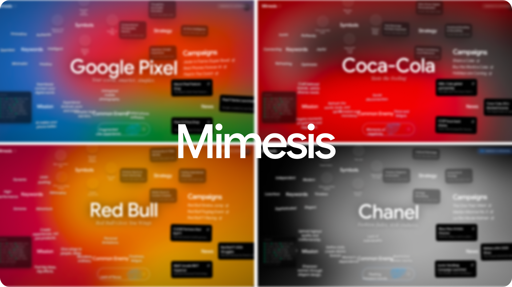
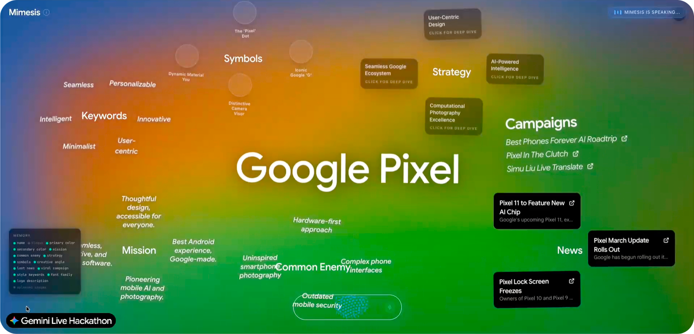
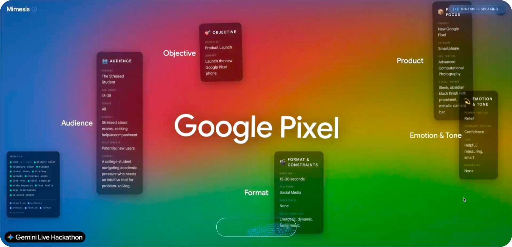
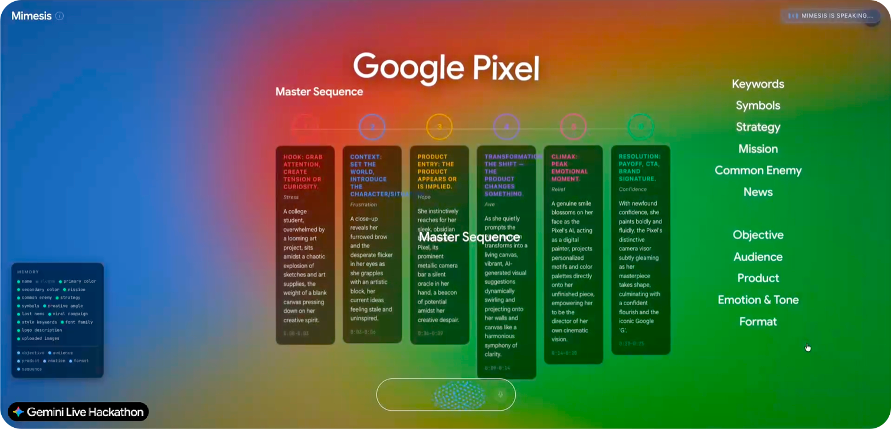
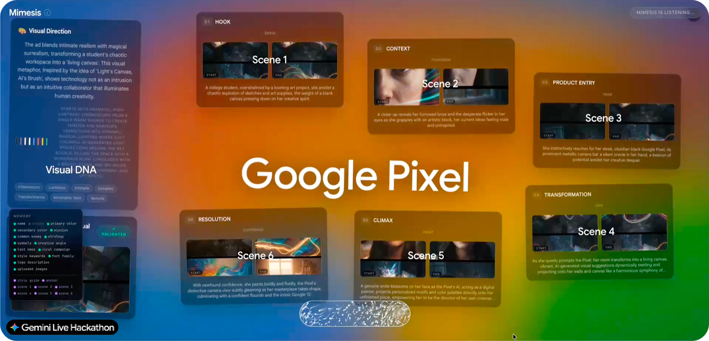
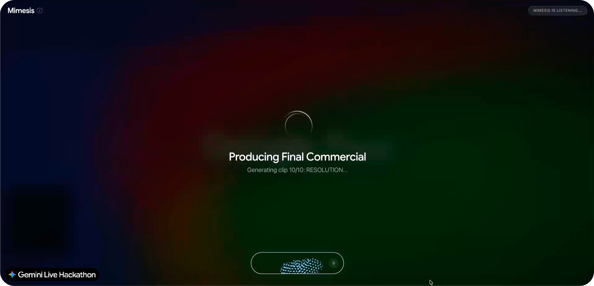
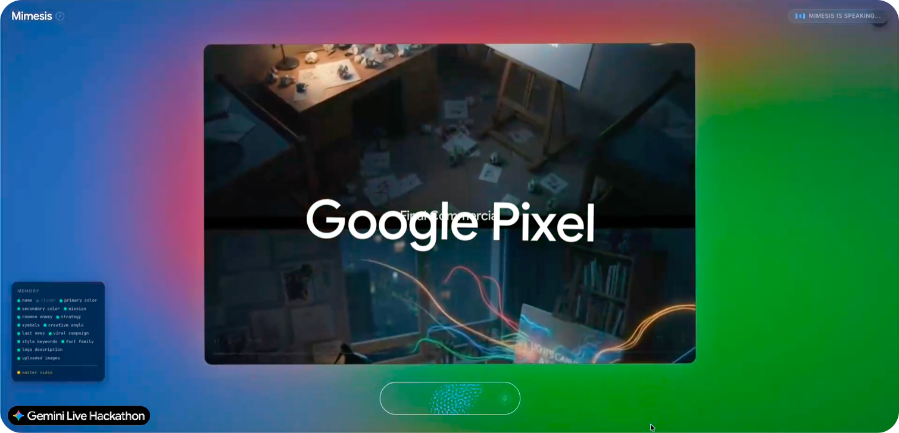

# 🎭 Mimesis

**Mimesis** is an AI-native **Creative Director** platform. It automates the entire advertising production workflow—from brand ideation and narrative sequencing to the generation of a video commercial.

Built on an **Event-Driven architecture**, Mimesis leverages the full power of **Google Cloud Vertex AI** to provide a seamless, voice-interactive creative experience.

[](https://vimeo.com/1174138197)




---

## 🔗 Live Demo

> ⚠️ IMPORTANT:
> This application runs on Cloud Run. Due to "cold starts," the backend may sometimes take longer to respond, resulting in a backend error.
> Therefore, you must close the page and reopen it. This will create a new session, allowing you to resume.

| Service | URL |
| :--- | :--- |
| **Frontend** | [Test Live Demo](https://mimesis-frontend-980118844637.us-central1.run.app) |
| **Backend** | [API Gateway](https://mimesis-backend-980118844637.us-central1.run.app) |

---

## ✨ Key Features

* **Real-time Voice Collaboration**: Converse directly with Mimesis via **Gemini Live (ADK)**.
* **Automated Brand DNA Research**: Give a brand name and Mimesis autonomously researches its visual identity, strategy, latest news, viral campaigns, cultural symbols, and philosophy, all in parallel via background workers.
* **Visual Product Analysis**: Upload a product image and **Gemini Vision** extracts its visual mood, dominant colors, and creative directions, linking them back to the brand DNA.
* **Interactive Creative Briefing**: Build the ad brief through a fast, conversational Q&A (objective, audience persona, emotion, format), not forms. The UI updates progressively as data is collected.
* **Scenario Co-Creation**: Pitch your own story ideas before generation. Mimesis weaves user input with brand intelligence to build a **6-act Master Sequence** (Hook → Resolution).
* **Cinematic UI Control**: The agent controls the interface in real-time, focusing, isolating, and animating data panels on screen like a creative war room.
* **Iterative Art Direction**: An anchor image sets the visual DNA, then **Imagen 3** generates start/end Keyframes for each scene. Review, give feedback, regenerate individual scenes, all by voice.
* **Video Production Pipeline**: **Veo 3.1** generates cinematic clips using keyframe interpolation and video extension. **FFmpeg** stitches them into a final x-second commercial.

---

## 🛠 Tech Stack & AI Models

| Model / Tech | Role |
| :--- | :--- |
| **Gemini Live (ADK)** | Bidirectional voice/audio streaming & agent interaction. |
| **Gemini 2.5 Flash/Pro** | Structural analysis, sequencing, thinking process and worker orchestration. |
| **Imagen 3** | High-fidelity Keyframe generation (Art Direction). |
| **Veo 3.1** | Cinematic video clip generation. |
| **Vertex AI** | Unified API gateway for all generative AI models. |
| **Cloud Run** | Serverless container hosting for backend & frontend. |
| **Cloud Storage (GCS)** | Asset storage for images, video clips, and final renders. |
| **FastAPI** | High-performance backend & WebSocket management. |
| **Next.js x GSAP** | Modern, responsive frontend with cinematic animations. |

---

## 🚀 Getting Started

### Prerequisites
- **Docker** & **Docker Compose** (recommended)
- A Google Cloud Project with Vertex AI & Google Cloud Storage APIs enabled.
- `gcloud` CLI authenticated (`gcloud auth application-default login`).

### Option 1: Docker (Recommended) — One Command

1. Configure your credentials in `backend/.env` (see the [`.env` Template](#-env-template-1) below).
2. From the project root:
   ```bash
   make docker-up
   ```
   This builds and launches both **backend** (`:8000`) and **frontend** (`:3000`) in containers.

| Command | Action |
| :--- | :--- |
| `make docker-up` | 🚀 Build & launch everything |
| `make docker-down` | 🛑 Stop all containers |
| `make docker-build` | 🔨 Build without launching |

### Option 2: Manual Setup

<details>
<summary>Click to expand manual instructions</summary>

#### Prerequisites
- Python 3.10+
- Node.js 18+

#### Backend
1. Configure `backend/.env`.
2. From the project root:
   ```bash
   make run-backend
   ```
   *The server will run at `http://localhost:8000`.*
3. To monitor background workers:
   ```bash
   make logs-backend
   ```

#### Frontend
1. Navigate to the frontend directory:
   ```bash
   cd frontend
   ```
2. Install dependencies and start the dev server:
   ```bash
   npm install
   npm run dev
   ```
   *Access the UI at `http://localhost:3000`.*

</details>

---

## 🧪 How to Test

Once the application is running, here is the full testing flow:

### Step 1 — Brand Research & Exploration



1. **Start a session**: Open the app and activate the voice agent. Mimesis will greet you and ask which brand you're working on.
2. **Give any brand name**: You can use any brand with an internet presence — *"Chanel"*, *"Netflix"*, *"Coca‑Cola"*, *"Nike"*, *"Apple"*…
3. **Watch the research unfold**: Mimesis dispatches background workers that autonomously research the brand's visual identity, strategy, latest news, viral campaigns, cultural symbols, and philosophy. Results appear on the UI as they arrive.

Once all the research is displayed, you can interact freely:
- **Ask for details** on any section — *"Tell me more about their strategy."*
- **Focus on a section** — *"Show me just the news."* The UI will cinematically isolate that panel.
- **Ask Mimesis to connect the dots** — *"What link can you make between the keywords and Chanel's strategy?"*

### Step 2 — Creative Briefing



When you have a clear understanding of the brand, say: *"Let's move to the next step."*

Mimesis then takes the lead and conducts a rapid creative interview through **3–4 questions**:
- **Vision & Product**: What's the objective? What product are we showcasing?
- **Audience & Emotion**: Who is the target? What emotion should the ad evoke?
- **Format & Constraints**: Duration, platforms, music direction, client mandatories?

> 💡 **Tip**: At any point you can **upload a product image** by dragging it onto the screen. Mimesis will analyze its visual mood, colors, and creative potential — and link it back to the brand DNA.

You can track everything Mimesis has collected in the **Memory component** (bottom-left of the UI).

### Step 3 — Scenario & Sequence



Once the brief is complete, Mimesis asks if you have any **scenario ideas** — a situation, a character, a visual concept. Share your vision or let Mimesis generate from scratch.

Mimesis then builds a **Master Sequence**: a 6-act emotional arc (Hook → Context → Product Entry → Transformation → Climax → Resolution). The timeline appears on screen. You can:
- **Approve** the sequence as-is.
- **Request changes by voice** — *"Make the hook more aggressive"*, *"Swap scenes 3 and 4."* The sequence regenerates automatically.

### Step 4 — Art Direction (Keyframes)



Once the sequence is locked, Mimesis launches the **Production Workshop**:
1. An **Anchor Image** is generated to define the visual DNA (lighting, palette, mood). Review and approve it.
2. **Keyframes** (start/end reference images) are generated for all 6 scenes using **Imagen 3**. Browse them scene by scene, give feedback, and regenerate individual scenes by voice.
3. When all scenes are approved, the visual storyboard is finalized.

### Step 5 — Final Video Generation

Ask Mimesis to generate the final commercial. **Veo 3.1** produces cinematic clips for each scene, and **FFmpeg** stitches them into a single video. When complete, the final ad appears on screen — ready for review.




---

## ⚙️ Architecture: The Worker System

Mimesis uses an asynchronous, event-driven worker system via **MCP (Model Context Protocol)** to handle heavy AI tasks without blocking the voice conversation:

**Workers 1–5 (Brand Research Sprint):**
Triggered as soon as a brand name is given. Five workers run **in parallel** via Gemini 2.5 Flash, each researching a different facet of the brand:
| Worker | Role |
| :--- | :--- |
| **Identity** | Extracts brand name, slogan, mission statement, and common enemy. |
| **Visual Identity** | Analyzes primary/secondary colors, typography, style keywords. |
| **News** | Fetches the latest headlines, press releases, and market moves. |
| **Culture & Campaigns** | Identifies the most iconic viral campaigns and brand symbols. |
| **Philosophy & Strategy** | Uncovers the brand's strategic direction, creative angles, and cultural references (art, cinema, music). |

Results are pushed to the UI progressively via WebSocket as each worker completes.

**Worker 6 (Vision):**
Dissects uploaded images to extract HEX color codes, visual mood, and stores the result on Cloud Storage. It updates the application state without interrupting the voice conversation, setting the brand's visual "Anchor."

**Worker 7 (Narrative):**
Combines Brand Intelligence and the creative brief to generate a 6-scene sequence via **Gemini 2.5 Flash**. It follows a strict emotional curve and sends the result to the Frontend via WebSocket in real time.

**Scene Workers (Director & Scene Worker):**
The `director.py` translates the master sequence into ultra-detailed aesthetic prompts. Then, the `scene_worker.py` calls **Imagen 3** to generate the Keyframes, using the initial product image as an "Anchor" to ensure product consistency from scene to scene.

**Worker 8 (Video Pipeline):**
The final conductor, composed of 3 sub-steps:
* **Prompt Generation**: Gemini translates the scene scripts into specific requests for Veo.
* **Veo 3.1**: Generates the clips. It intelligently uses either Keyframe interpolation (for main scenes) or video extension (for *insert shots*), working around Veo's constraints (which prohibit combining a textual reference image with a start image).
* **FFmpeg Stitching**: Assembles all the `.mp4` files into a single x-second commercial, smoothed and ready for broadcast.

---

## 💾 Data Management

The project manages data on two distinct levels:

1. **State Store (Application Memory)**
   Manages all session-specific data in application memory (scalable to Cloud SQL or Firestore). It includes:
   - Brand information: `brand_name`, `brand_slogan`, `brand_mission`, `brand_common_enemy`.
   - Art direction: `creative_angles`, `brand_symbols`, `style_keywords`.
   - The brief: `ad_objective`, `audience_persona`, `ad_tone`.
   - UI state: Currently `visible_components`.

2. **Google Cloud Storage (GCS)**
   All binary assets are stored in a dedicated GCS bucket, organized by Session ID: `gs://[BUCKET_NAME]/[PREFIX]/[SESSION_ID]/`. It contains:
   - User uploads (e.g., the `"anchor_image_uri"`).
   - All generated Keyframes in PNG format (`scene_1_keyframe_start.png`).
   - All raw video clips from Veo (`clip_01_main_scene.mp4`).
   - The final video render (`final_commercial.mp4`).

---

## 📡 Essential Endpoints

| Endpoint | Description |
| :--- | :--- |
| **`ws://.../ws/{user_id}`** | Main voice/event stream (Gemini Live). |
| **`ws://.../ws/state/{session_id}`** | Real-time UI layout updates pushed to the frontend. |
| **`POST /api/session/notify`** | Allows workers to inject system notifications into Gemini Live's context (e.g., "The video is ready!"). |
| **`POST /api/state/update`** & **`POST /api/state/layout`** | Internal endpoints used by the agent's Tools to modify what the user sees. |
| **`POST /api/session/upload-image`** | Entry point for images dropped onto the Frontend, which kicks off the GCS process. |
| **`GET /api/gcs-proxy`** | Secure proxy for serving GCS assets to the frontend without making the bucket public. |

---

## 🔑 `.env` Template

Save this as `.env` inside your **`backend/`** folder.

```env
# Google Cloud Configuration
GOOGLE_CLOUD_PROJECT="your-project-id"
GOOGLE_CLOUD_LOCATION="us-central1"

# Vertex AI Model IDs
GEMINI_MODEL_ID="gemini-2.5-flash"
IMAGEN_MODEL_ID="gemini-2.5-flash-image"
VEO_MODEL_ID="veo-3.1-generate-preview"

# Storage
GCS_BUCKET_NAME="your-mimesis-assets-bucket"

# App Settings
DEBUG=True
ALLOWED_ORIGINS="http://localhost:3000"
```
